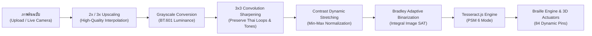

# BrailleLens 3D & Optical OCR System
> **Tactical 14-Cell / 84-Pin Refreshable Braille Hardware Simulator & Real-Time Optical OCR Workstation**
> *ระบบจำลองอุปกรณ์แสดงผลอักษรเบรลล์ 14 เซลล์ 84 หมุด แบบ 3 มิติ และระบบตรวจจับถอดรหัสข้อความด้วยเทคโนโลยี Optical OCR*

---

## 📌 1. ภาพรวมโปรเจกต์ (Project Overview)

**BrailleLens 3D & Optical OCR System** เป็นระบบจำลองฮาร์ดแวร์อักษรเบรลล์ระดับวิศวกรรมแบบ Interactive 3D (WebGL / Three.js) ผสานกับระบบรู้จำอักขระด้วยแสง (Optical Character Recognition - OCR) ที่ประมวลผลบน Client-Side 100% ด้วย Web Workers (Tesseract.js v5) โดยไม่ต้องพึ่งพาเซิร์ฟเวอร์ภายนอก

ระบบรองรับการแปลงข้อความภาษาไทย (Thai), ภาษาอังกฤษ (English Grade 1 / Alphabetic), และตัวเลข (Numeric 0-9) ให้เป็นตำแหน่งการยกตัวของหมุดเบรลล์ 6 จุดต่อเซลล์ รวม 14 เซลล์ (84 หมุด) แบบ Real-Time พร้อมระบบหน้าจอแสดงผลเสมือน (Virtual OLED/LCD HUD), โหมดผ่าโครงสร้างภายใน (X-Ray Cutaway), โหมดแยกชิ้นส่วน (Exploded View), และโมเดลจำลองกลไก Bistable Electro-Cam Actuator 0W Power Latch

---

## 🚀 2. ฟีเจอร์หลัก (Key Features)

| Feature | คำอธิบาย (Description) |
| :--- | :--- |
| **🎮 Interactive 3D Hardware Simulation** | จำลองตัวเครื่อง Braille Display 14 เซลล์ 84 หมุด ด้วย Three.js r128 พร้อมระบบควบคุมมุมมองกล้อง (OrbitControls), จัดแสงเงาสมจริง, ระบบคลิกเลือกเซลล์ และโหมด Presentation หมุนอัตโนมัติ |
| **📷 Omni-Channel Optical OCR** | รองรับการสแกน 2 ช่องทาง: **(1) ลากวางไฟล์ภาพ (Drag & Drop / File Picker)** และ **(2) กล้องสด WebRTC (Live Camera Viewfinder)** พร้อม Shutter Freeze Animation |
| **⚡ Canvas 2D Preprocessing Pipeline** | อัลกอริทึมขยายภาพ 2x/3x Upscaling, ฟิลเตอร์เพิ่มความคมชัด 3x3 Convolution Sharpening, ปรับสมดุลคอนทราสต์ Min-Max Stretching, และ Bradley Adaptive Integral Binarization เพื่อเพิ่มความแม่นยำของสระ/วรรณยุกต์ไทย |
| **📑 14-Cell Tactical Pagination** | ระบบหั่นแบ่งข้อความยาวเป็นชุดละ 14 ตัวอักษร (`PAGE X/Y [start-end]`) รองรับการเปลี่ยนหน้าด้วยปุ่ม PREV / NEXT และคีย์ลัดคีย์บอร์ด `ArrowLeft` / `ArrowRight` |
| **🌐 Single-Language Mode Switcher** | ปุ่มสลับโหมดภาษา ENG / THAI ได้ในคลิกเดียว อัปเดตทั้งพจนานุกรมเบรลล์, ตัวเลือกภาษา OCR, และข้อความตัวอย่าง Preset ทันที |
| **⚙️ Bistable Electro-Cam Actuator Modal** | โมดูล 3D ผ่าดูการทำงานระดับกลไก 1 หมุดเบรลล์ แสดงการทำงาน 4 สถานะ (สภาวะพัก 0W, พัลส์ดันหมุด 2.4W, ตัดไฟล็อกตำแหน่ง 0W Bistable Latch, และสลับขั้วรีเซ็ต) |
| **🌓 Cyberpunk Tactical Theme (Dark/Light)** | รองรับการสลับโหมดมืด (Dark Mode) และโหมดสว่าง (Light Mode) พร้อมบันทึกสถานะผ่าน `localStorage` โดยปรับทั้ง UI และแสงเงาในฉาก 3D สอดคล้องกัน |

---

## 📂 3. โครงสร้างไดเรกทอรีโปรเจกต์ (Project Directory Structure)

```text
braillend/
├── index.html                           # หน้าเว็บหลักของแอปพลิเคชัน (Entry HTML)
├── BraillLens_Interactive_3D.html       # ไฟล์ HTML รวมฉบับเดี่ยว (Standalone Legacy File)
├── architecture.md                      # เอกสารสถาปัตยกรรมระบบและ Data Flow ละเอียด
├── task-graph.md                        # บันทึกแผนงานและขั้นตอนการพัฒนา (Task Graph)
├── README.md                            # คู่มือการติดตั้งและใช้งานระบบ
├── css/
│   └── styles.css                       # `css/styles.css` สไตล์ชีต Cyberpunk-Tactical Theme (Dark/Light Mode)
├── js/
│   ├── app.js                           # `js/app.js` Entry Point: เริ่มต้นระบบและผูก Event Listeners
│   ├── braille-engine.js                # `js/braille-engine.js` พจนานุกรมเบรลล์, 14-Cell Chunking, และ Pagination
│   ├── ocr-engine.js                    # `js/ocr-engine.js` Canvas Preprocessor, Tesseract.js, และ WebRTC Camera
│   └── three-scene.js                   # `js/three-scene.js` Three.js Scene, 84-Pin Actuation, OLED, และ Exploded View
└── tests/
    └── test_braille_ocr_pipeline.js     # `tests/test_braille_ocr_pipeline.js` Autonomous QA Test Suite
```

---

## 🛠️ 4. สถาปัตยกรรมระบบ (System Architecture & Pipeline)

### 4.1 Optical OCR Preprocessing Flow


### 4.2 กลไก Bistable Electro-Cam 0W Power Latch
1. **State 1 (สภาวะพัก - Idle Down)**: ไฟฟ้า 0.0W หมุดอยู่ระดับ 0.0mm ไม่กินไฟ
2. **State 2 (จ่ายไฟพัลส์ - Actuation Pulse)**: จ่ายไฟพัลส์ 50ms (2.4W / 0.48A) สนามแม่เหล็กหมุนลูกเบี้ยว 180° ดันหมุดขึ้น 1.2mm
3. **State 3 (ตัดไฟล็อกตำแหน่ง - 0W Bistable Latch)**: ตัดกระแสไฟ 100% (0.0W) ลูกเบี้ยวล็อกตำแหน่งหมุดค้างไว้โดยไม่ต้องจ่ายไฟเลี้ยง
4. **State 4 (สลับขั้วไฟฟ้า - Reverse Reset)**: จ่ายไฟพัลส์ย้อนกลับหมุนลูกเบี้ยวกลับ 0° ดึงหมุดลงสู่สภาวะพัก

---

## 📖 5. คู่มือการใช้งาน (Step-by-Step User Manual)

### 1) การเปิดใช้งานโปรแกรม (Getting Started)
- ดับเบิลคลิกเปิดไฟล์ `index.html` บนเว็บเบราว์เซอร์สมัยใหม่ (Google Chrome, Microsoft Edge, Firefox, หรือ Safari)
- ระบบจะโหลดโมเดล 3D, จอแสดงผล OLED, และปุ่มกด Interactive 3D Buttons บนตัวเครื่องขึ้นมาโดยอัตโนมัติ

### 2) การพิมพ์ข้อความและการแปลงเป็นอักษรเบรลล์ (Manual Translation)
1. พิมพ์ข้อความในกล่องข้อความ **THAI / ENG BRAILLE ENGINE** หรือคลิกเลือกข้อความสำเร็จรูป (Preset Chips)
2. หมุดทั้ง 84 หมุดบนโมเดล 3 มิติ (ความสูงนูนสมจริง 1.2mm) และการ์ด 14 ช่องบนจอจะเคลื่อนไหวตามรหัสอักษรเบรลล์ทันที
3. หากข้อความยาวเกิน 14 ตัวอักษร ระบบจะสร้างหน้า Pagination อัตโนมัติ:
   - กดปุ่ม `◄ PREV` บนหน้าจอ หรือ**คลิกปุ่ม 3D PREV บนตัวเครื่องโมเดลโดยตรง** (หรือกดแป้นคีย์บอร์ด `←` Arrow Left) เพื่อดูหน้าก่อนหน้า
   - กดปุ่ม `NEXT ►` บนหน้าจอ หรือ**คลิกปุ่ม 3D NEXT บนตัวเครื่องโมเดลโดยตรง** (หรือกดแป้นคีย์บอร์ด `→` Arrow Right) เพื่อดูหน้าถัดไป
   - คลิกปุ่ม **3D MODE บนตัวเครื่องโมเดลโดยตรง** เพื่อสลับโหมดภาษา (THAI / ENG) แบบเรียลไทม์ พร้อมเอฟเฟกต์ปุ่มกดยุบตัว 3D จริง!

### 3) การสแกนรูปภาพด้วย OCR (Image File Upload OCR)
1. เลือกโหมดภาษาที่ต้องการตรวจจับจากเมนู `LANG:` (`ไทย + ENG`, `ภาษาไทย`, `English`)
2. ลากไฟล์ภาพ (`PNG`, `JPG`, `WebP`) มาวางในพื้นที่ Dropzone หรือกดปุ่ม `เลือกไฟล์ภาพ`
3. ระบบจะประมวลผล Canvas Preprocessing และถอดรหัสข้อความผ่าน Tesseract.js โดยแสดงแถบสถานะ Progress HUD และเปอร์เซ็นต์ความมั่นใจ (Confidence Score)
4. ข้อความที่สแกนได้จะถูกส่งเข้าสู่ Braille Engine และดันหมุด 3D ทันที

### 4) การสแกนผ่านกล้องสด (Live Camera Scan)
1. กดปุ่ม `สแกนกล้องสด (Live Camera)` เพื่อเปิดหน้าต่างเล็งกล้อง
2. อนุญาตให้เบราว์เซอร์เข้าถึงกล้องถ่ายภาพ (Camera Permission)
3. จัดวางตัวอักษรให้อยู่ในกรอบเล็ง Tactical Frame
4. กดปุ่ม **ชัตเตอร์ (Capture)** ระบบจะบันทึกภาพและถอดรหัสเป็นอักษรเบรลล์ในทันที
5. สามารถกดปุ่ม `สลับกล้อง (Flip)` เพื่อสลับระหว่างกล้องหน้าและกล้องหลังได้

### 5) การสำรวจชิ้นส่วน 3 มิติ (3D Inspection Modes)
- **โหมดกล่องโปร่งใส (X-Ray Cutaway)**: กดปุ่ม `👁️ โหมดกล่องโปร่งใส` เพื่อมองทะลุโครงสร้างเคส เห็นแผงวงจรหลัก PCB, Raspberry Pi Zero 2 W, และชุดกลไกคอยล์แม่เหล็ก
- **โหมดแยกชิ้นส่วน (Exploded View)**: กดปุ่ม `🧩 โหมดแยกชิ้นส่วน` เพื่อคลี่ชิ้นส่วน 6 เลเยอร์ออกจากกันในแนวตั้ง พร้อมเส้นโยงและป้ายกำกับชื่อชิ้นส่วน
- **ดูการทำงานกลไกภายใน (Mechanism Modal)**: กดปุ่ม `⚙️ ดูการทำงานภายใน` เพื่อเปิดห้องทดลองจำลอง 1 หมุดเบรลล์แบบ Interactive

---

## 🧪 6. การทดสอบความถูกต้องอัตโนมัติ (Automated QA Test Suite)

รันชุดทดสอบความสมบูรณ์ของระบบผ่าน Node.js:

```bash
node ./tests/test_braille_ocr_pipeline.js
```

### เกณฑ์การตรวจสอบของชุดทดสอบ (Test Coverage):
1. **HTML5 Document & Assets Integrity**: ตรวจสอบ DOCTYPE, แท็กโครงสร้าง, และลิงก์ CDN ภายนอกครบถ้วน
2. **CSS3 Stylesheet & Theme Consistency**: ตรวจสอบการปิดบล็อก Braces, CSS Variables ทั้งโหมด Dark และ Light, และคลาส OCR ทั้งหมด
3. **DOM Structure & Elements ID**: ตรวจสอบ ID สำคัญครบทุกจุด (Dropzone, Camera, Modal, Pagination, Language Toggle)
4. **JavaScript VM Syntax & Sandboxing**: คอมไพล์ไฟล์ JS ทั้งหมดผ่าน Node `vm.Script` รับประกันว่าปราศจาก Syntax Error 100%
5. **Logic & Algorithms QA**: ทดสอบอัลกอริทึม 3x3 Convolution Sharpening, 14-Cell Chunking, Boundary Clamping, และพจนานุกรมเบรลล์

---

## 📄 7. ใบอนุญาต (License)
ลิขสิทธิ์โปรเจกต์ภายใต้มาตรฐาน Sovereign Logic Standard (Open Source for Educational & Assistive Technology Research).
