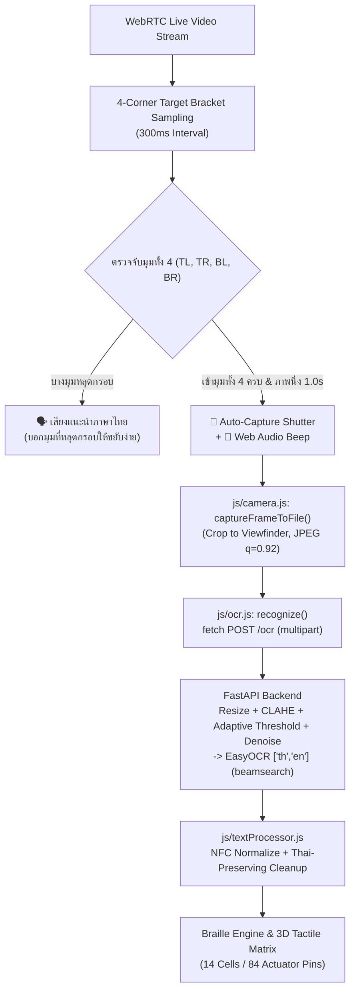

# BrailleLens 3D & Optical OCR System
> **Tactical 14-Cell / 84-Pin Refreshable Braille Hardware Simulator & Real-Time Optical OCR Workstation**
> *ระบบจำลองอุปกรณ์แสดงผลอักษรเบรลล์ 14 เซลล์ 84 หมุด แบบ 3 มิติ และระบบตรวจจับถอดรหัสข้อความด้วยเทคโนโลยี Optical OCR*

---

## 📌 1. ภาพรวมโปรเจกต์ (Project Overview)

**BrailleLens 3D & Optical OCR System** เป็นระบบจำลองฮาร์ดแวร์อักษรเบรลล์ระดับวิศวกรรมแบบ Interactive 3D (WebGL / Three.js) ผสานกับระบบรู้จำอักขระด้วยแสง (Optical Character Recognition - OCR) ที่เน้นความแม่นยำภาษาไทยเป็นหลัก โดยส่วนหน้า (frontend) เป็น Vanilla HTML/JS แบบ Zero-Build และส่งภาพไปประมวลผลที่ Backend แยกต่างหาก (FastAPI + EasyOCR รองรับ `th` + `en`) ผ่าน HTTP - ดูวิธีติดตั้งและรัน Backend ได้ที่ [`backend/README.md`](backend/README.md)

ระบบรองรับการแปลงข้อความภาษาไทย (Thai), ภาษาอังกฤษ (English Grade 1 / Alphabetic), และตัวเลข (Numeric 0-9) ให้เป็นตำแหน่งการยกตัวของหมุดเบรลล์ 6 จุดต่อเซลล์ รวม 14 เซลล์ (84 หมุด) แบบ Real-Time พร้อมระบบหน้าจอแสดงผลเสมือน (Virtual OLED/LCD HUD), โหมดผ่าโครงสร้างภายใน (X-Ray Cutaway), โหมดแยกชิ้นส่วน (Exploded View), โมเดลจำลองกลไก Bistable Electro-Cam Actuator 0W Power Latch, และ**ระบบเสียงนำทางภาษาไทย (Voice Guidance) พร้อมระบบชัตเตอร์อัตโนมัติ (Auto-Capture on Stability) สำหรับผู้พิการทางสายตา**

---

## 🚀 2. ฟีเจอร์หลัก (Key Features)

| Feature | คำอธิบาย (Description) |
| :--- | :--- |
| **🎮 Interactive 3D Hardware Simulation** | จำลองตัวเครื่อง Braille Display 14 เซลล์ 84 หมุด ด้วย Three.js r128 พร้อมระบบควบคุมมุมมองกล้อง (OrbitControls), จัดแสงเงาสมจริง, ระบบคลิกเลือกเซลล์, ปุ่มกดจำลอง 3D กดได้จริง และโหมด Presentation หมุนอัตโนมัติ |
| **📱 Portrait Mode (9:16) & Full Native Live Feed** | ปรับหน้าต่างกล้องสดและกรอบเล็งให้เป็น **แนวตั้ง (Portrait Mode 9:16)** ทรงกระดาษ A4 / หน้าหนังสือ สตรีมภาพ Full HD 1080x1920 คมชัดระดับสูงสุด แสดงผลแบบ Full Native Feed ไม่มีการคลิปตัดขอบภาพวิดีโอ (No pre-cropping) พร้อมรองรับการรันบนสมาร์ตโฟนจริง |
| **🔍 Laplacian Variance Focus Detector & Focus Gating** | ระบบคำนวณความคมชัดของขอบอักขระบนเฟรมกล้องสดด้วย 3x3 Laplacian Kernel (`calculateLaplacianFocusScore`) พร้อมระบบ **Focus Gating ป้องกันการลั่นชัตเตอร์เมื่อภาพเบลอ (Score < 80)** และจะอนุญาตให้ถ่ายภาพได้ก็ต่อเมื่อ **Focus Score >= 160 (SHARP 100%)** พร้อมเสียงแนะนำภาษาไทยและแถบ HUD แสดงระดับความคมชัด Real-time |
| **🎯 Visual 4-Corner Target Brackets + Neon Glow** | แสดงกรอบ 4 มุมเรืองแสงบน Viewfinder Box (`#cornerTL`, `#cornerTR`, `#cornerBL`, `#cornerBR`) พร้อมป้ายสถานะกำกับ (`TL: LOCKED`, `TR: LOCKED`, `BL: MISSED`, `BR: MISSED`) เมื่อมุมไหนเข้าเป้า จะเปลี่ยนเป็น **สีเขียวนีออนเรืองแสง (`#00FF88`)** พร้อมเอฟเฟกต์ไฟกะพริบ Pulse ทันทีแบบ Real-time |
| **📊 Real-time 4-Corner Status Overlay Panel** | แถบ HUD สรุปสถานะ 4 มุมด้านบนของหน้าต่างกล้องสด แสดงเปอร์เซ็นต์ความพร้อม **`4-CORNER ALIGNMENT: 75% (3/4 CORNERS LOCKED)`** และเมื่อครบ 4 มุมจะขึ้นข้อความตัวใหญ่เรืองแสงสีเขียว **`[ 🎯 TARGET LOCKED 100% - AUTO CAPTURING... ]`** |
| **🗣️ Assistive 4-Corner Voice Guidance** | ระบบเสียงสังเคราะห์ภาษาไทย (Web Speech API `th-TH`) แนะนำการจัดวางกระดาษอย่างง่ายดาย เช่น *"มุมบนซ้ายหลุดกรอบ"*, *"มุมล่างขวาหลุดกรอบ"*, *"เข้ามุมทั้ง 4 เรียบร้อยแล้ว ถือค้างไว้นะครับ..."* |
| **📸 1.0s Rapid Auto-Capture Shutter** | เมื่อมุมทั้ง 4 เข้าสู่กรอบเป้าหมายครบถ้วนและภาพนิ่งต่อเนื่อง 1.0 วินาที ระบบจะส่งเสียง *"เข้ามุมทั้ง 4 เรียบร้อยแล้ว ถือค้างไว้นะครับ..."* พร้อมสัญญาณปี๊บและสั่งลั่นชัตเตอร์ถ่ายภาพอัตโนมัติ |
| **🔍 Visual OCR Bounding Box Inspector** | แสดงภาพสแกนจริงบน Canvas พร้อมวาดกรอบเรืองแสงนีออน (Glowing Neon Bounding Boxes) ล้อมรอบคำทุกคำที่สแกนได้ (`result.data.words`) และพ่นป้ายข้อความกำกับบนกรอบ พร้อมปุ่มกดดูย้อนหลังได้อย่างชัดเจน |
| **🎯 Viewfinder Crop Engine** | อัลกอริทึมตัดพิกเซลภาพเฉพาะบริเวณภายในกรอบเล็ง `.viewfinder-box` เท่านั้น ตัดขอบและพื้นหลังที่รบกวนทิ้ง 100% ทำให้ OCR แม่นยำสูงสุด |
| **⚡ Thai-Focused EasyOCR Backend** | ส่งภาพ (จากอัปโหลดหรือกล้อง) ไปยัง Backend (FastAPI + EasyOCR `['th','en']`, `decoder='beamsearch'`) ที่ทำ Resize, CLAHE Contrast Enhancement, Adaptive Threshold (เมื่อแสงไม่สม่ำเสมอ), และ Denoise (ปรับความแรงตามแหล่งภาพ อัปโหลด vs กล้อง) ก่อนถอดข้อความ |
| **📑 14-Cell Tactical Pagination** | ระบบหั่นแบ่งข้อความยาวเป็นชุดละ 14 ตัวอักษร (`PAGE X/Y [start-end]`) รองรับการเปลี่ยนหน้าด้วยปุ่ม PREV / NEXT และคีย์ลัดคีย์บอร์ด `ArrowLeft` / `ArrowRight` |
| **🌐 Single-Language Mode Switcher** | ปุ่มสลับโหมดภาษา ENG / THAI ได้ในคลิกเดียว อัปเดตทั้งพจนานุกรมเบรลล์, ตัวเลือกภาษา OCR, และข้อความตัวอย่าง Preset ทันที |
| **⚙️ Bistable Electro-Cam Actuator Modal** | โมดูล 3D ผ่าดูการทำงานระดับกลไก 1 หมุดเบรลล์ แสดงการทำงาน 4 สถานะ (สภาวะพัก 0W, พัลส์ดันหมุด 2.4W, ตัดไฟล็อกตำแหน่ง 0W Bistable Latch, และสลับขั้วรีเซ็ต) |
| **🌓 Cyberpunk Tactical Theme (Dark/Light)** | รองรับการสลับโหมดมืด (Dark Mode) และโหมดสว่าง (Light Mode) พร้อมบันทึกสถานะผ่าน `localStorage` โดยปรับทั้ง UI และแสงเงาในฉาก 3D สอดคล้องกัน |

---

## 📂 3. โครงสร้างไดเรกทอรีโปรเจกต์ (Project Directory Structure)

```text
braillend/
├── index.html                           # หน้าเว็บหลักของแอปพลิเคชัน (Entry HTML)
├── BraillLens_Interactive_3D.html       # ไฟล์ HTML รวมฉบับเดี่ยว (Standalone Legacy File)
├── architecture.md                      # เอกสารสถาปัตยกรรมระบบและ Data Flow ละเอียด
├── task-graph.md                        # บันทึกแผนงานและขั้นตอนการพัฒนา (Task Graph)
├── README.md                            # คู่มือการติดตั้งและใช้งานระบบ
├── css/
│   └── styles.css                       # `css/styles.css` สไตล์ชีต Cyberpunk-Tactical Theme (Dark/Light Mode)
├── js/
│   ├── app.js                           # `js/app.js` Entry Point: เริ่มต้นระบบและผูก Event Listeners
│   ├── braille-engine.js                # `js/braille-engine.js` พจนานุกรมเบรลล์, 14-Cell Chunking, และ Pagination
│   ├── voice-guidance.js                # `js/voice-guidance.js` ระบบเสียงแนะนำภาษาไทยและการตรวจจับเป้าหมาย 4 มุม
│   ├── camera.js                        # `js/camera.js` Camera Stream Lifecycle, Viewfinder Crop, Frame Capture (Client-only)
│   ├── ocr.js                           # `js/ocr.js` OCR Module - ONLY place that calls the backend `/ocr` endpoint
│   ├── textProcessor.js                 # `js/textProcessor.js` NFC Normalize & Thai-Preserving Text Cleanup
│   ├── demoMode.js                      # `js/demoMode.js` Hardcoded Thai Demo Sample (no network)
│   ├── ocr-engine.js                    # `js/ocr-engine.js` OCR Orchestration & UI Glue (Dropzone, Camera Modal, Inspector)
│   └── three-scene.js                   # `js/three-scene.js` Three.js Scene, 84-Pin Actuation, OLED, และ Exploded View
├── backend/
│   ├── main.py                          # FastAPI app, `POST /ocr` endpoint
│   ├── preprocessing.py                 # OpenCV/Pillow preprocessing (resize, CLAHE, threshold, denoise)
│   ├── ocr_engine.py                    # EasyOCR (`th`+`en`) wrapper
│   ├── requirements.txt                 # Backend Python dependencies
│   └── README.md                        # Backend setup & run instructions
└── tests/
    └── test_braille_ocr_pipeline.js     # `tests/test_braille_ocr_pipeline.js` Autonomous QA Test Suite
```

---

## 🛠️ 4. สถาปัตยกรรมระบบ (System Architecture & Pipeline)

### 4.1 Optical OCR & Assistive Vision Pipeline


### 4.2 กลไก Bistable Electro-Cam 0W Power Latch
1. **State 1 (สภาวะพัก - Idle Down)**: ไฟฟ้า 0.0W หมุดอยู่ระดับ 0.0mm ไม่กินไฟ
2. **State 2 (จ่ายไฟพัลส์ - Actuation Pulse)**: จ่ายไฟพัลส์ 50ms (2.4W / 0.48A) สนามแม่เหล็กหมุนลูกเบี้ยว 180° ดันหมุดขึ้น 1.2mm
3. **State 3 (ตัดไฟล็อกตำแหน่ง - 0W Bistable Latch)**: ตัดกระแสไฟ 100% (0.0W) ลูกเบี้ยวล็อกตำแหน่งหมุดค้างไว้โดยไม่ต้องจ่ายไฟเลี้ยง
4. **State 4 (สลับขั้วไฟฟ้า - Reverse Reset)**: จ่ายไฟพัลส์ย้อนกลับหมุนลูกเบี้ยวกลับ 0° ดึงหมุดลงสู่สภาวะพัก

---

## 📖 5. คู่มือการใช้งาน (Step-by-Step User Manual)

### 1) การเปิดใช้งานโปรแกรม (Getting Started)
- ดับเบิลคลิกเปิดไฟล์ `index.html` บนเว็บเบราว์เซอร์สมัยใหม่ (Google Chrome, Microsoft Edge, Firefox, หรือ Safari)
- ระบบจะโหลดโมเดล 3D, จอแสดงผล OLED, และปุ่มกด Interactive 3D Buttons บนตัวเครื่องขึ้นมาโดยอัตโนมัติ
- **สำหรับฟีเจอร์ OCR (อัปโหลดภาพ / กล้องสด)** ต้องรัน Backend ก่อน: ดูวิธีติดตั้งที่ [`backend/README.md`](backend/README.md) แล้วรัน `uvicorn main:app --port 8000` (ค้างไว้ที่ `http://localhost:8000`) - ถ้ายังไม่ได้รัน Backend ให้ลองใช้ปุ่ม `DEMO MODE` แทน ซึ่งใช้ข้อความไทยตัวอย่างที่กำหนดไว้ล่วงหน้า ไม่ต้องเชื่อมต่อ Backend

### 2) การสแกนผ่านกล้องสด, ระบบ Visual HUD 4 มุม และ Focus Gating ตรวจจับความคมชัด (Live Camera, 4-Corner HUD & Focus Gating)
1. กดปุ่ม `สแกนกล้องสด (Live Camera)` เพื่อเปิดหน้าต่างเล็งกล้อง
2. ระบบจะแสดงกรอบเล็ง 4 มุมเรืองแสง (`#cornerTL`, `#cornerTR`, `#cornerBL`, `#cornerBR`) พร้อมป้ายสถานะกำกับ (`TL: LOCKED`, `TR: LOCKED`, `BL: MISSED`, `BR: MISSED`)
3. แถบ HUD สรุปสถานะ 4 มุมด้านบนของหน้าต่างกล้องจะแสดงเปอร์เซ็นต์ความพร้อมแบบ Real-time เช่น `4-CORNER ALIGNMENT: 75% (3/4 CORNERS LOCKED)`
4. แถบ Real-Time Focus HUD แสดงระดับความคมชัดของภาพ:
   - `[ 🔴 FOCUS: BLURRY (Score XX) ]` (คะแนน < 80: ภาพเบลอ ระบบสั่งล็อกชัตเตอร์ป้องกันภาพเบลอเข้าสู่ OCR)
   - `[ 🟡 FOCUS: ADJUSTING (Score XX) ]` (คะแนน 80-159: กำลังปรับโฟกัส)
   - `[ 🟢 FOCUS: SHARP 100% (Score XX) ]` (คะแนน >= 160: ตัวหนังสือคมชัดสูงสุด 100%)
5. ระบบเสียงแนะนำภาษาไทย (Focus & Directional Voice Guidance):
   - หากภาพเบลอ: พูดว่า *"ภาพยังเบลออยู่ ถือกล้องนิ่งๆ อีกนิดนะครับ"*
   - เมื่อเอกสารเข้ามุมครบและตัวหนังสือชัดกริบ (Score >= 160): พูดว่า *"ตัวอักษรชัดเจนแล้ว ถือค้างไว้นะครับ..."*
   - เมื่อถือนิ่ง 1.0 วินาที ระบบจะพูดเตือน *"กำลังถ่ายภาพ อยู่นิ่งๆ นะครับ"* พร้อมสัญญาณ `ปี๊บ!` และถ่ายภาพอัตโนมัติ
6. บนหัวหน้าต่างมีปุ่มเปิด/ปิด `[🔊 Voice: ON/OFF]` และ `[📸 Auto-Capture: ON/OFF]` สำหรับควบคุมการทำงานตามต้องการ
7. ภาพที่ถ่ายจะถูก Crop ตัดเอาเฉพาะในกรอบเล็ง นำไปประมวลผลคอนทราสต์สูง และถอดรหัสเป็นอักษรเบรลล์ทันที

---

## 🧪 6. การทดสอบความถูกต้องอัตโนมัติ (Automated QA Test Suite)

รันชุดทดสอบความสมบูรณ์ของระบบผ่าน Node.js:

```bash
node ./tests/test_braille_ocr_pipeline.js
```

### เกณฑ์การตรวจสอบของชุดทดสอบ (Test Coverage):
1. **HTML5 Document & Assets Integrity**: ตรวจสอบ DOCTYPE, แท็กโครงสร้าง, และลิงก์ CDN ภายนอกครบถ้วน
2. **CSS3 Stylesheet & Theme Consistency**: ตรวจสอบการปิดบล็อก Braces, CSS Variables ทั้งโหมด Dark และ Light, คลาส OCR, Voice HUD, และปุ่ม Toggle ทั้งหมด
3. **DOM Structure & Elements ID**: ตรวจสอบ ID สำคัญครบทุกจุด (Dropzone, Camera, Viewfinder, Voice Guidance, Auto-Capture, Pagination, Language Toggle)
4. **JavaScript VM Syntax & Sandboxing**: คอมไพล์ไฟล์ JS ทั้งหมดผ่าน Node `vm.Script` รับประกันว่าปราศจาก Syntax Error 100%
5. **Logic & Algorithms QA**: ทดสอบ Viewfinder Crop, OCR Module Separation (`js/ocr.js` / `js/camera.js` / `js/textProcessor.js` / `js/demoMode.js`), Backend Preprocessing Pipeline (`backend/preprocessing.py`), Voice Guidance Phrases, Auto-Capture Timer Math, 14-Cell Chunking, และพจนานุกรมเบรลล์

---

## 📄 7. ใบอนุญาต (License)
ลิขสิทธิ์โปรเจกต์ภายใต้มาตรฐาน Sovereign Logic Standard (Open Source for Educational & Assistive Technology Research).
