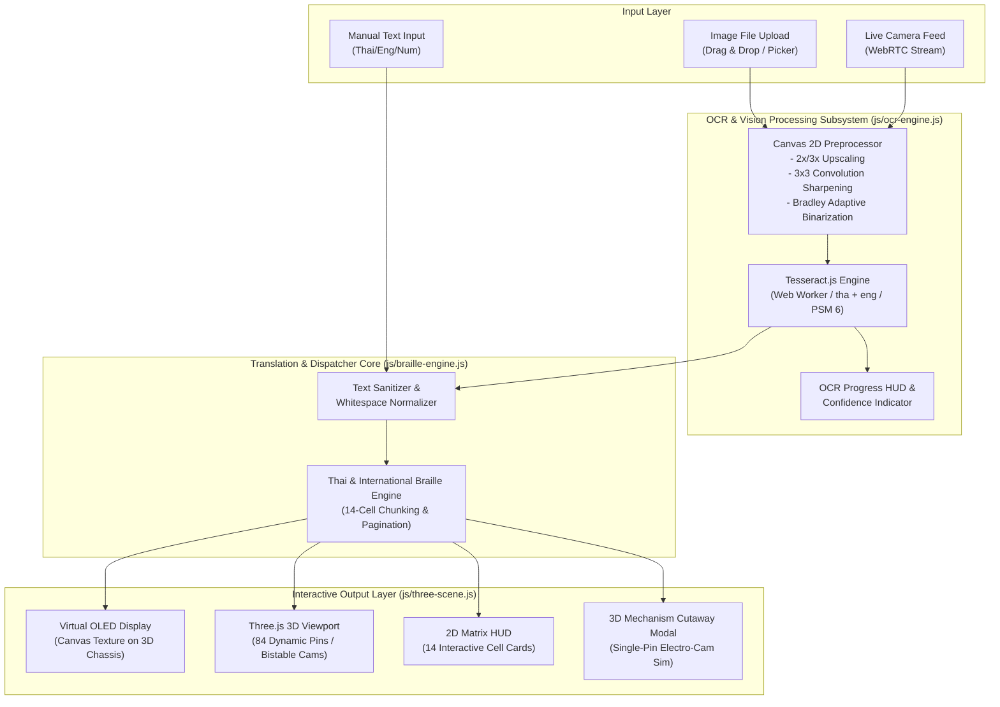

# BraillLens 3D - System Architecture & Technical Specification
Version: 3.1.0 (Modular Codebase Standard)

---

## 1. System Overview
**BraillLens 3D & Optical OCR System** is an interactive tactile Braille hardware simulator and translation workstation. The system simulates a 14-cell / 84-pin bistable electromagnetic Braille refreshable display in full interactive 3D (WebGL / Three.js), complete with mechanical engineering cutaway views, real-time OLED text synchronization, and an optical character recognition (OCR) pipeline.

### Core Objectives
1. **Interactive 3D Hardware Simulation**: Render realistic 14-cell / 84-pin tactile actuator pins with bistable physics, X-Ray cutaway, exploded view, and 3D mechanism inspection.
2. **Thai & International Braille Engine**: Translate Thai, English (Grade 1 / Alphabetic), and Numeric text into tactile 6-dot matrix pin actuations.
3. **Omni-Channel OCR Ingestion Engine**:
   - **Image Upload OCR**: Drag-and-drop or file selection of image files (`.png`, `.jpg`, `.jpeg`, `.webp`) with client-side image enhancement.
   - **Live Camera OCR**: Live WebRTC video stream viewfinder with frame freeze, capture shutter effect, ROI cropping, and optical text extraction.
4. **Modular Architecture & Zero-Dependency Portability**: Separated into maintainable CSS and JavaScript modules (`css/`, `js/`, `index.html`) with standalone client-side execution.

---

## 2. Tech Stack Specification

| Layer | Technology | Version / CDN | Purpose |
| :--- | :--- | :--- | :--- |
| **Frontend Framework** | Vanilla HTML5 / Modern ES6+ JavaScript | Standard | Ultra-lightweight, modular zero-build deployment, maximum performance |
| **3D Graphics Engine** | Three.js & OrbitControls | r128 | Interactive 3D WebGL rendering, shaders, lighting, exploded view |
| **Styling & UI Design** | CSS3 Custom Properties (Dark/Light Mode) | Modern CSS | Cyber-tactical UI, glassmorphism, responsive control panel (`css/styles.css`) |
| **Icons & Typography** | FontAwesome 6, Google Fonts (Prompt, JetBrains Mono) | 6.4.0 CDN | Tactical icons, monospace telemetry fonts, Thai glyph support |
| **Client-Side OCR Engine** | Tesseract.js | v5 (CDN) | In-browser multi-language OCR (`tha`, `eng`, `tha+eng`) via Web Workers |
| **Image Preprocessing** | HTML5 Canvas 2D Context | Native API | 2x/3x upscaling, 3x3 convolution sharpening, adaptive binarization |
| **Live Video Capture** | WebRTC `navigator.mediaDevices.getUserMedia` | Native API | Live camera stream, facing mode toggle, shutter capture |

---

## 3. Modular Directory Structure

```text
braillend/
├── index.html                           # Main Application Entry Point
├── BraillLens_Interactive_3D.html       # Standalone Legacy File
├── architecture.md                      # Architecture & Technical Specification
├── task-graph.md                        # Task Execution Graph & Milestones
├── README.md                            # Comprehensive Bilingual User Guide
├── css/
│   └── styles.css                       # Cyberpunk-Tactical Stylesheet (Dark & Light Mode)
├── js/
│   ├── app.js                           # Entry Point & Event Dispatcher
│   ├── braille-engine.js                # Braille Mapping, 14-Cell Chunking, & Pagination
│   ├── ocr-engine.js                    # Canvas Preprocessor, Tesseract Worker, & Camera
│   └── three-scene.js                   # Three.js 3D Viewport, Actuator Array, & OLED Texture
└── tests/
    └── test_braille_ocr_pipeline.js     # Sandboxed QA Verification Suite
```

---

## 4. System Architecture Diagram



---

## 5. Component Structure & Data Flow

### 5.1 OCR Subsystem Data Flow
1. **Source Acquisition (`js/ocr-engine.js`)**:
   - **Upload**: User drops or selects an image file $\rightarrow$ `FileReader` converts to DataURL / `HTMLImageElement`.
   - **Live Camera**: User opens Camera Modal $\rightarrow$ `navigator.mediaDevices.getUserMedia({ video: { facingMode: 'environment' } })` streams video $\rightarrow$ User presses Capture $\rightarrow$ snapshot rendered to hidden canvas.
2. **Image Preprocessing (`preprocessImageForOCR`)**:
   - Grayscale conversion: $Y = 0.299R + 0.587G + 0.114B$
   - 3x3 Convolution Sharpening Kernel $[0, -1, 0; -1, 5, -1; 0, -1, 0]$
   - Min-Max Contrast Dynamic Stretching.
   - Fast Bradley Adaptive Integral Local Thresholding.
3. **Tesseract Worker Execution (`runOCRExtraction`)**:
   - Tesseract.js Worker initialized with language configuration (`tha+eng` / `PSM 6`).
   - Progress callbacks update real-time progress bar and state indicators on UI.
   - Result string extracted, cleaned, and injected into `thaiInput` textarea.
4. **Trigger Actuation (`applyOCRResultToSystem` & `updateBrailleDisplay`)**:
   - Updates 3D OLED screen texture.
   - Actuates 84 tactile pins in Three.js scene with smooth easing interpolation.
   - Pulses DATA LED and updates 2D Matrix HUD cards.

---

## 6. Security, Performance & Fallback Protocols
- **Client-Side Privacy**: All OCR processing occurs locally in browser Web Workers. No images or camera streams are transmitted to external servers.
- **Hardware Acceleration**: Three.js WebGL and Canvas 2D pipelines utilize GPU acceleration for 60 FPS rendering.
- **Resource Cleanup**: Camera video tracks are immediately stopped (`track.stop()`) when modal is closed to prevent battery drain and camera lock.
- **Error Handling**: Graceful fallback when camera permission is denied, image cannot be parsed, or low OCR confidence is detected.
