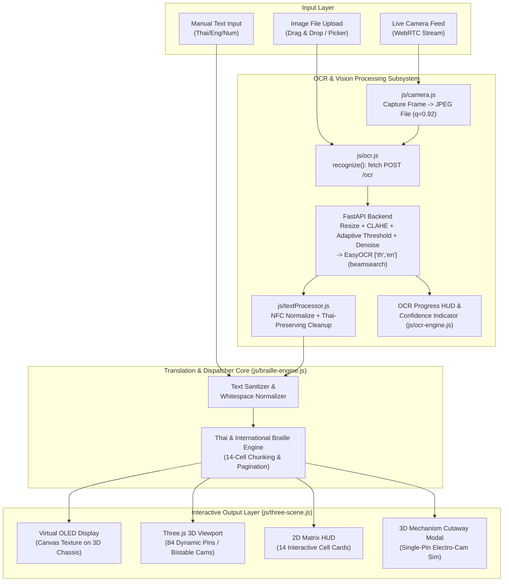

# BraillLens 3D - System Architecture & Technical Specification
Version: 3.1.0 (Modular Codebase Standard)

---

## 1. System Overview
**BraillLens 3D & Optical OCR System** is an interactive tactile Braille hardware simulator and translation workstation. The system simulates a 14-cell / 84-pin bistable electromagnetic Braille refreshable display in full interactive 3D (WebGL / Three.js), complete with mechanical engineering cutaway views, real-time OLED text synchronization, and an optical character recognition (OCR) pipeline.

### Core Objectives
1. **Interactive 3D Hardware Simulation**: Render realistic 14-cell / 84-pin tactile actuator pins with bistable physics, X-Ray cutaway, exploded view, and 3D mechanism inspection.
2. **Thai & International Braille Engine**: Translate Thai, English (Grade 1 / Alphabetic), and Numeric text into tactile 6-dot matrix pin actuations.
3. **Omni-Channel OCR Ingestion Engine**:
   - **Image Upload OCR**: Drag-and-drop or file selection of image files (`.png`, `.jpg`, `.jpeg`, `.webp`) with client-side image enhancement.
   - **Live Camera OCR**: Live WebRTC video stream viewfinder with frame freeze, capture shutter effect, ROI cropping, and optical text extraction.
4. **Modular Architecture & Zero-Dependency Portability**: Separated into maintainable CSS and JavaScript modules (`css/`, `js/`, `index.html`) with standalone client-side execution.

---

## 2. Tech Stack Specification

| Layer | Technology | Version / CDN | Purpose |
| :--- | :--- | :--- | :--- |
| **Frontend Framework** | Vanilla HTML5 / Modern ES6+ JavaScript | Standard | Ultra-lightweight, modular zero-build deployment, maximum performance |
| **3D Graphics Engine** | Three.js & OrbitControls | r128 | Interactive 3D WebGL rendering, shaders, lighting, exploded view |
| **Styling & UI Design** | CSS3 Custom Properties (Dark/Light Mode) | Modern CSS | Cyber-tactical UI, glassmorphism, responsive control panel (`css/styles.css`) |
| **Icons & Typography** | FontAwesome 6, Google Fonts (Prompt, JetBrains Mono) | 6.4.0 CDN | Tactical icons, monospace telemetry fonts, Thai glyph support |
| **OCR Engine (Backend)** | EasyOCR (Python) | 1.7.x | Thai + English OCR (`['th','en']`, `decoder='beamsearch'`, `paragraph=False`) served via FastAPI over HTTP |
| **OCR Backend Framework** | FastAPI + Uvicorn | latest | `POST /ocr` multipart endpoint, CORS-enabled for local frontend |
| **Server-Side Preprocessing** | OpenCV / Pillow | latest | Resize, CLAHE contrast enhancement, adaptive threshold, source-aware denoise |
| **Image Preprocessing** | HTML5 Canvas 2D Context | Native API | 2x/3x upscaling, 3x3 convolution sharpening, adaptive binarization |
| **Live Video Capture** | WebRTC `navigator.mediaDevices.getUserMedia` | Native API | Live camera stream, facing mode toggle, shutter capture |

---

## 3. Modular Directory Structure

```text
braillend/
├── index.html                           # Main Application Entry Point
├── BraillLens_Interactive_3D.html       # Standalone Legacy File
├── architecture.md                      # Architecture & Technical Specification
├── task-graph.md                        # Task Execution Graph & Milestones
├── README.md                            # Comprehensive Bilingual User Guide
├── css/
│   └── styles.css                       # Cyberpunk-Tactical Stylesheet (Dark & Light Mode)
├── js/
│   ├── app.js                           # Entry Point & Event Dispatcher
│   ├── braille-engine.js                # Braille Mapping, 14-Cell Chunking, & Pagination
│   ├── camera.js                        # Camera Stream Lifecycle, Viewfinder Crop, Frame Capture (client-only)
│   ├── ocr.js                           # OCR Module - only place that calls the backend /ocr endpoint
│   ├── textProcessor.js                 # NFC Normalization & Thai-Preserving Text Cleanup
│   ├── demoMode.js                      # Hardcoded Thai Demo Sample (no network)
│   ├── ocr-engine.js                    # OCR Orchestration & UI Glue (Dropzone, Camera Modal, Inspector)
│   └── three-scene.js                   # Three.js 3D Viewport, Actuator Array, & OLED Texture
├── backend/
│   ├── main.py                          # FastAPI app, POST /ocr endpoint
│   ├── preprocessing.py                 # OpenCV/Pillow preprocessing pipeline
│   ├── ocr_engine.py                    # EasyOCR (th+en) wrapper
│   └── requirements.txt                 # Backend Python dependencies
└── tests/
    └── test_braille_ocr_pipeline.js     # Sandboxed QA Verification Suite
```

---

## 4. System Architecture Diagram



---

## 5. Component Structure & Data Flow

### 5.1 OCR Subsystem Data Flow
1. **Source Acquisition**:
   - **Upload**: User drops or selects an image file in `js/ocr-engine.js` (`handleImageFileSelect`) $\rightarrow$ File object passed directly into the unified pipeline.
   - **Live Camera**: User opens Camera Modal $\rightarrow$ `js/camera.js`'s `startCameraStream()` runs `navigator.mediaDevices.getUserMedia({ video: { facingMode: 'environment' } })` $\rightarrow$ User presses Capture (or auto-capture fires) $\rightarrow$ `captureFrameToFile()` crops the viewfinder region and exports a JPEG File (q=0.92).
   - Both paths converge on the **same** `runOcrPipeline(file, documentSource)` in `js/ocr-engine.js` - `documentSource: 'upload' | 'camera'` is a UI label only, passed through to the backend purely to tune preprocessing intensity.
2. **OCR Call (`js/ocr.js` - the only module that knows how OCR is performed)**:
   - `recognize(file, documentSource)` POSTs multipart form data to the FastAPI backend's `POST /ocr`.
3. **Server-Side Preprocessing & Recognition (`backend/preprocessing.py`, `backend/ocr_engine.py`)**:
   - Resize so the shorter side is >= 640px, grayscale, CLAHE contrast enhancement (critical for small Thai tone/vowel marks), adaptive threshold when lighting looks uneven, and denoise (stronger for `documentSource: 'camera'`).
   - `easyocr.Reader(['th', 'en'])` runs `readtext(decoder='beamsearch', paragraph=False)`, returning per-word text, axis-aligned bounding boxes, and confidence (0-100 scale).
4. **Text Normalization (`js/textProcessor.js`)**:
   - Unicode NFC normalization (required so Thai combining tone/vowel marks compose correctly), preserves the Thai Unicode block plus latin/digits/punctuation, collapses whitespace, and never forces uppercase (Thai has no case).
   - If overall confidence is below ~50%, the pipeline surfaces an "image unclear, try again" message instead of passing text to the Braille engine.
5. **Trigger Actuation (`applyOCRResultToSystem` & `updateBrailleDisplay`)**:
   - Updates 3D OLED screen texture.
   - Actuates 84 tactile pins in Three.js scene with smooth easing interpolation.
   - Pulses DATA LED and updates 2D Matrix HUD cards.

**Demo Mode** (`js/demoMode.js`) bypasses this entire pipeline: it returns a hardcoded Thai sample string after an artificial delay, useful for showcasing the app without a camera or a running backend.

---

## 6. Security, Performance & Fallback Protocols
- **OCR Backend Boundary**: Captured/uploaded images are sent over HTTP to the local OCR backend (`http://localhost:8000`) for processing - this is no longer a fully client-side pipeline. Run the backend on a trusted machine/network; it is intended for local development, not public exposure without additional hardening (auth, TLS, rate limiting).
- **Hardware Acceleration**: Three.js WebGL and Canvas 2D pipelines utilize GPU acceleration for 60 FPS rendering.
- **Resource Cleanup**: Camera video tracks are immediately stopped (`track.stop()`) when modal is closed to prevent battery drain and camera lock.
- **Error Handling**: Graceful fallback when camera permission is denied, image cannot be parsed, or low OCR confidence is detected.
