# BraillLens 3D - Task Graph & Implementation Plan
Version: 3.5.0 (Portrait Mode 9:16 Live Camera & Book Viewfinder Modal)

---

## Plan Overview
This execution plan details the architecture and implementation of **BraillLens 3D & Optical OCR System**, including:
1. **Interactive 3D Simulation**: 14-cell / 84-pin tactile simulator with Three.js r128, X-Ray cutaway, exploded view, and 0W bistable latch mechanism.
2. **Omni-Channel OCR Ingestion**: Drag-and-drop file upload and live WebRTC camera capture with Canvas 2D preprocessing and Tesseract.js v5.
3. **14-Cell Tactical Pagination & Mode Switcher**: Single-language toggle (ENG/THAI), 14-cell chunking, and tactile Prev/Next navigation.
4. **Assistive Voice Guidance & Auto-Capture**: Web Speech API Thai voice feedback (`th-TH`), 300ms live stream alignment analysis, and 1.0s stability-triggered automatic shutter.
5. **Viewfinder Crop Engine & Grayscale-First OCR**: Optical framing box cropping to eliminate 100% background artifacts with exact DOM-to-native scale factoring, safety clamping & 85% center fallback; BT.601 + Contrast Stretching + Auto Polarity Inversion (preserving subpixel anti-aliasing for Tesseract v5 LSTM), and PSM 3 mode.
6. **Visual Real-Time 4-Corner HUD & Status Overlay**: Real-time bracket glow (`#00FF88`), status tags (`TL/TR/BL/BR: LOCKED` vs `MISSED`), and top HUD overlay showing `4-CORNER ALIGNMENT: 75% (3/4 CORNERS LOCKED)` and `[ 🎯 TARGET LOCKED 100% - AUTO CAPTURING... ]`.
7. **Portrait Mode (9:16) Live Camera & Viewfinder Modal**: Native Full HD vertical WebRTC stream constraints (1080x1920, aspectRatio: 9/16), vertical book/A4 framing proportions (480px width, 80vh height, aspect-ratio: 9/16), and coordinate-scaled portrait crop engine.
8. **Modular Architecture**: Clean separation into `index.html`, `css/styles.css`, `js/braille-engine.js`, `js/ocr-engine.js`, `js/voice-guidance.js`, `js/three-scene.js`, `js/app.js`, and `README.md`.

---

## Execution Graph

```mermaid
graph TD
    P1["Phase 1: Dependencies & Styling Setup"] --> P2["Phase 2: OCR UI & Camera Viewfinder Construction"]
    P2 --> P3["Phase 3: Image Preprocessing & Tesseract.js Engine"]
    P3 --> P4["Phase 4: Pipeline Integration & Actuator Feedback"]
    P4 --> P5["Phase 5: Autonomous Verification & QA"]
    P5 --> P6["Phase 6: 14-Cell Pagination & Mode Switcher"]
    P6 --> P7["Phase 7: Modular Decomposition & Documentation"]
    P7 --> P8["Phase 8: Pin Height Calibration & 3D Interactive Hardware Buttons"]
    P8 --> P9["Phase 9: English-Only OCR Engine Locking & UI Streamlining"]
    P9 --> P10["Phase 10: Live Camera High-Res Denoising & Adaptive Binarization Pipeline"]
    P10 --> P11["Phase 11: Viewfinder Crop Engine, Thai Voice Guidance & Auto-Capture"]
    P11 --> P12["Phase 12: Crop Scale Calibration & Voice Guidance Relaxation"]
    P12 --> P13["Phase 13: Text-Block Boundary Detection & Visual OCR Inspector"]
    P13 --> P14["Phase 14: Visual Real-Time 4-Corner HUD & Status Overlay Panel"]
    P14 --> P15["Phase 15: Portrait Mode 9:16 Live Camera & Book Viewfinder Modal"]
    P15 --> P16["Phase 16: Pre-Capture Thai Voice Warning & Shutter Audio Synchronization"]
    P16 --> P17["Phase 17: Laplacian Variance Focus Detector & Focus Gating System"]
    P17 --> P18["Phase 18: Full Native Camera Feed & Mobile Deployment Readiness"]
```

---

## Detailed Task Breakdown

### Phase 1: Dependencies & Styling Setup
- [x] **Task 1.1: Integrate Tesseract.js v5 CDN into Document Header**
- [x] **Task 1.2: Add OCR UI Styles, Camera Viewfinder & Dark/Light Mode Tokens**

### Phase 2: OCR UI & Camera Viewfinder Construction
- [x] **Task 2.1: Construct OCR Ingestion Section in Control Panel**
- [x] **Task 2.2: Construct Live Camera Viewfinder Modal**
- [x] **Task 2.3: Construct OCR Progress HUD & Telemetry Status Bar**

### Phase 3: Image Preprocessing & Tesseract.js Engine
- [x] **Task 3.1: Implement Enhanced Canvas 2D Image Preprocessor**
- [x] **Task 3.2: Implement Tesseract.js Worker Engine (PSM 6 Mode)**
- [x] **Task 3.3: Implement Image File Upload & Drag-and-Drop Event Handlers**
- [x] **Task 3.4: Implement WebRTC Camera Controller & Snapshot Capture**

### Phase 4: Pipeline Integration & Actuator Feedback
- [x] **Task 4.1: Connect OCR Output to Braille Engine & 3D Hardware Simulation**
- [x] **Task 4.2: Add Tactical Feedback Signals & Telemetry Log**

### Phase 5: Autonomous Verification & QA
- [x] **Task 5.1: Create Autonomous Test Suite Script**
- [x] **Task 5.2: Validate HTML Syntax, CDN Links, and WebGL Context Stability**

### Phase 6: 14-Cell Tactical Pagination & Single-Language Mode Switcher
- [x] **Task 6.1: Implement 14-Cell Text Chunking & Pagination Navigation Engine**
- [x] **Task 6.2: Build Cyberpunk-Tactical Hardware Control Bar & Mode Switcher**

### Phase 7: Modular Decomposition & Documentation
- [x] **Task 7.1: Extract CSS Stylesheet into `css/styles.css`**
- [x] **Task 7.2: Split JavaScript into Dedicated Modules in `js/`**
- [x] **Task 7.3: Create Main Entry File `index.html`**
- [x] **Task 7.4: Author Comprehensive Bilingual `README.md` User Manual**
- [x] **Task 7.5: Update Autonomous QA Test Suite for Modular Codebase**

### Phase 8: Pin Height Calibration & 3D Interactive Hardware Buttons
- [x] **Task 8.1: Pin Protrusion Scale Calibration (0.13 / 1.2mm Engineering Scale)**
- [x] **Task 8.2: 3D Hardware Button Meshes & High-Res Dynamic Canvas Textures**
- [x] **Task 8.3: Three.js Raycaster Mouse Interaction & Physical Press Effect**
- [x] **Task 8.4: Autonomous QA Test Suite Expansion**

### Phase 9: English-Only OCR Engine Locking & UI Streamlining
- [x] **Task 9.1: Lock Tesseract.js OCR Engine to English Only (`eng`)**
- [x] **Task 9.2: Set English Defaults across UI, Braille Engine, and Application Bootstrapper**
- [x] **Task 9.3: QA Test Suite Verification & Task Graph Synchronization**

### Phase 10: Live Camera High-Res Denoising & Adaptive Binarization Pipeline
- [x] **Task 10.1: High-Res Native Video Capture (1080p Full HD)**
- [x] **Task 10.2: Camera Denoising Image Processing Pipeline**
- [x] **Task 10.3: Crystal Clear Processed Denoised Dropzone Preview**
- [x] **Task 10.4: Autonomous QA Test Suite Expansion & Validation**

### Phase 11: Viewfinder Crop Engine, Thai Voice Guidance & Auto-Capture for Visually Impaired
- [x] **Task 11.1: Viewfinder Crop Engine (`captureCameraSnapshot`)**
- [x] **Task 11.2: Grayscale-First High-Contrast OCR Preprocessing Pipeline**
- [x] **Task 11.3: Realtime Assistive Thai Voice Guidance System**
- [x] **Task 11.4: Auto-Capture on Document Alignment & Stability**
- [x] **Task 11.5: Voice Guidance & Auto-Capture Toggle Controls on Camera Modal**
- [x] **Task 11.6: QA Test Suite Expansion & Documentation Sync**

### Phase 12: Viewfinder Crop Scale Calibration & Voice Guidance Relaxation
- [x] **Task 12.1: Viewfinder Crop Precision & Safety Clamping (`calculateViewfinderCrop`)**
- [x] **Task 12.2: Voice Guidance Sensitivity & Tolerance Relaxation**
- [x] **Task 12.3: Verification with Autonomous QA Suite**

### Phase 13: Text-Block Boundary Detection & Visual OCR Bounding Box Inspector
- [x] **Task 13.1: Text-Block Boundary Detection & Center 70% Density Scanning**
- [x] **Task 13.2: 1.0s Rapid Stability Auto-Capture Shutter & Audio Feedback**
- [x] **Task 13.3: Visual OCR Bounding Box Inspector Engine & Neon Overlays**
- [x] **Task 13.4: Autonomous QA Test Suite Expansion & Documentation Sync**

### Phase 14: Visual Real-Time 4-Corner HUD & Status Overlay Panel
- [x] **Task 14.1: Visual 4-Corner Target Brackets & Neon Glow Status Badges**
  - **Files**: `file:///C:/Users/kt856/Downloads/Compressed/beaill/braillend/index.html`, `file:///C:/Users/kt856/Downloads/Compressed/beaill/braillend/css/styles.css`
  - **Logic/Target**: Construct `#cornerTL`, `#cornerTR`, `#cornerBL`, `#cornerBR` HUD bracket overlays with status badges (`#labelTL`, `#labelTR`, `#labelBL`, `#labelBR`) showing `TL: LOCKED`, `TR: LOCKED`, `BL: MISSED`, `BR: MISSED`, with neon emerald glowing borders (`#00FF88`) and `@keyframes targetLockPulse` pulsing effect.
- [x] **Task 14.2: Real-time 4-Corner Status Overlay Panel (`#cornerStatusOverlay`)**
  - **Files**: `file:///C:/Users/kt856/Downloads/Compressed/beaill/braillend/index.html`, `file:///C:/Users/kt856/Downloads/Compressed/beaill/braillend/css/styles.css`, `file:///C:/Users/kt856/Downloads/Compressed/beaill/braillend/js/voice-guidance.js`
  - **Logic/Target**: Real-time HUD summary bar displaying percentage alignment (e.g. `4-CORNER ALIGNMENT: 75% (3/4 CORNERS LOCKED)`), switching to prominent green glowing banner `[ 🎯 TARGET LOCKED 100% - AUTO CAPTURING... ]` when all 4 corners are locked.
- [x] **Task 14.3: Assistive 4-Corner Directional Voice Prompts & Auto-Capture Shutter**
  - **Files**: `file:///C:/Users/kt856/Downloads/Compressed/beaill/braillend/js/voice-guidance.js`
  - **Logic/Target**: Voice prompt feedback when corners slip (*"มุมบนซ้ายหลุดกรอบ"*, *"มุมล่างขวาหลุดกรอบ"*, etc.), and when all 4 corners are locked and camera is held still for 1.0s, speak *"เข้ามุมทั้ง 4 เรียบร้อยแล้ว ถือค้างไว้นะครับ..."* and trigger automatic camera shutter capture with tactical beep tone.
- [x] **Task 14.4: Autonomous QA Test Suite Expansion & Documentation Sync**
  - **Files**: `file:///C:/Users/kt856/Downloads/Compressed/beaill/braillend/tests/test_braille_ocr_pipeline.js`, `file:///C:/Users/kt856/Downloads/Compressed/beaill/braillend/README.md`, `file:///C:/Users/kt856/Downloads/Compressed/beaill/braillend/task-graph.md`
  - **Logic/Target**: 28 unit & integration tests passing 100%.

### Phase 16: Pre-Capture Thai Voice Warning & Shutter Audio Synchronization
- [x] **Task 16.1: Pre-Capture Thai Voice Warning ("อยู่นิ่งๆ นะครับ")**
  - **Files**: `file:///C:/Users/kt856/Downloads/Compressed/beaill/braillend/js/voice-guidance.js`
  - **Logic/Target**: When 4 corners are locked and camera is stable, trigger Thai voice prompt *"กำลังถ่ายภาพ อยู่นิ่งๆ นะครับ"* 0.5s before automatic shutter capture.
- [x] **Task 16.2: Audio Beep & Shutter Capture Sequence**
  - **Files**: `file:///C:/Users/kt856/Downloads/Compressed/beaill/braillend/js/voice-guidance.js`, `file:///C:/Users/kt856/Downloads/Compressed/beaill/braillend/js/ocr-engine.js`
  - **Logic/Target**: After pre-capture warning speech finishes, trigger tactical beep `playTacticalBeep(1050, 220)` and shutter snapshot `captureCameraSnapshot()`.
- [x] **Task 16.3: Autonomous QA Verification & Test Suite Expansion**
  - **Files**: `file:///C:/Users/kt856/Downloads/Compressed/beaill/braillend/tests/test_braille_ocr_pipeline.js`, `file:///C:/Users/kt856/Downloads/Compressed/beaill/braillend/task-graph.md`
  - **Logic/Target**: 29 unit & integration tests passing 100%.

### Phase 17: Laplacian Variance Focus Detector & Focus Gating System
- [x] **Task 17.1: Laplacian Variance Focus Detection Algorithm (`calculateLaplacianFocusScore`)**
  - **Files**: `file:///C:/Users/kt856/Downloads/Compressed/beaill/braillend/js/voice-guidance.js`
  - **Logic/Target**: 3x3 Laplacian Kernel (`[0, 1, 0; 1, -4, 1; 0, 1, 0]`) convolution calculating variance of Laplacian across camera frames; Score < 80: BLURRY, Score >= 160: SHARP 100%.
- [x] **Task 17.2: Real-time Focus Guidance Thai Voice Prompts**
  - **Files**: `file:///C:/Users/kt856/Downloads/Compressed/beaill/braillend/js/voice-guidance.js`
  - **Logic/Target**: Thai voice prompts for blurry (*"ภาพยังเบลออยู่ ถือกล้องนิ่งๆ อีกนิดนะครับ"*) and sharp focus (*"ตัวอักษรชัดเจนแล้ว ถือค้างไว้นะครับ..."*).
- [x] **Task 17.3: Focus Gating Shutter Protection (Score >= 160 Requirement)**
  - **Files**: `file:///C:/Users/kt856/Downloads/Compressed/beaill/braillend/js/voice-guidance.js`
  - **Logic/Target**: Auto-capture shutter gated strictly on `Focus Score >= 160` (SHARP 100%) in addition to 4-corner lock and camera stability, preventing blurry images from entering Tesseract OCR 100%.
- [x] **Task 17.4: Real-time Visual Focus Status HUD on Camera Viewfinder**
  - **Files**: `file:///C:/Users/kt856/Downloads/Compressed/beaill/braillend/index.html`, `file:///C:/Users/kt856/Downloads/Compressed/beaill/braillend/css/styles.css`, `file:///C:/Users/kt856/Downloads/Compressed/beaill/braillend/js/voice-guidance.js`
  - **Logic/Target**: `#focusStatusHud` overlay displaying `[ 🔴 FOCUS: BLURRY (Score XX) ]`, `[ 🟡 FOCUS: ADJUSTING (Score XX) ]`, and `[ 🟢 FOCUS: SHARP 100% (Score XX) ]` with neon glow animations.
- [x] **Task 17.5: Autonomous QA Verification & Test Suite Expansion**
  - **Files**: `file:///C:/Users/kt856/Downloads/Compressed/beaill/braillend/tests/test_braille_ocr_pipeline.js`, `file:///C:/Users/kt856/Downloads/Compressed/beaill/braillend/README.md`, `file:///C:/Users/kt856/Downloads/Compressed/beaill/braillend/task-graph.md`
  - **Logic/Target**: 33 unit & integration tests passing 100%.

### Phase 18: Full Native Camera Feed & Mobile Deployment Readiness
- [x] **Task 18.1: Full Aspect Ratio Native Live Camera Feed (No Pre-Cropping)**
  - **Files**: `file:///C:/Users/kt856/Downloads/Compressed/beaill/braillend/css/styles.css`, `file:///C:/Users/kt856/Downloads/Compressed/beaill/braillend/js/ocr-engine.js`
  - **Logic/Target**: Configure `#cameraVideo` to `object-fit: contain;` and adaptive sizing to prevent video clipping, ensuring 100% of the live camera feed is visible.
- [x] **Task 18.2: Mobile WebRTC Environment Facing Mode & Fallback Cascade**
  - **Files**: `file:///C:/Users/kt856/Downloads/Compressed/beaill/braillend/js/ocr-engine.js`
  - **Logic/Target**: Request `facingMode: { ideal: 'environment' }` with cascade fallbacks for smartphone rear cameras.
- [x] **Task 18.3: Mobile Smartphone Responsive Viewport Styling**
  - **Files**: `file:///C:/Users/kt856/Downloads/Compressed/beaill/braillend/css/styles.css`
  - **Logic/Target**: Fullscreen mobile viewport modal styling (`@media (max-width: 640px)`) with tactile controls.
- [x] **Task 18.4: Computer Vision Pipeline & Autonomous QA Verification**
  - **Files**: `file:///C:/Users/kt856/Downloads/Compressed/beaill/braillend/js/voice-guidance.js`, `file:///C:/Users/kt856/Downloads/Compressed/beaill/braillend/tests/test_braille_ocr_pipeline.js`, `file:///C:/Users/kt856/Downloads/Compressed/beaill/braillend/README.md`
  - **Logic/Target**: Variance of Laplacian ($\text{Var} \ge 160$), Canny Edge / Contour detection, Pre-capture voice warning, 33/33 tests passing 100%.

### Phase 19: Automated Real Usage Simulation & Multi-Line Paging
- [x] **Task 19.1: Real-World Automated Camera Motion & Voice Guidance Engine**
  - **Files**: `file:///C:/Users/kt856/Downloads/Compressed/beaill/braillend/js/real-simulation.js`, `file:///C:/Users/kt856/Downloads/Compressed/beaill/braillend/index.html`
  - **Logic/Target**: Automated camera scanning viewport with voice prompts ("ขยับกล้องไปทางขวา", "ขยับเข้าใกล้", "ภาพพร้อม กำลังถ่ายภาพ"), smooth auto-positioning animations, and flash snapshot capture.
- [x] **Task 19.2: Multi-Line OCR Text Stream & Interactive Next / Back Paging**
  - **Files**: `file:///C:/Users/kt856/Downloads/Compressed/beaill/braillend/js/real-simulation.js`
  - **Logic/Target**: Multi-line Thai document scanning simulation ("สวัสดีครับ", "วันนี้อากาศดีมาก", "ขอให้เป็นวันที่ดี", "สำหรับทุกคน") with interactive [◀ Back] and [Next ▶] buttons feeding the 14-cell 84-pin 3D Braille display.
- [x] **Task 19.3: Autonomous Verification & QA Suite Integration**
  - **Files**: `file:///C:/Users/kt856/Downloads/Compressed/beaill/braillend/tests/test_braille_ocr_pipeline.js`
  - **Logic/Target**: 43 unit & integration tests passing 100%.

### Phase 20: 2-Cell ESP32 Realtime Tactile Workstation & Dynamic Web Redesign
- [x] **Task 20.1**: Web Serial API Driver & Auto-Connect Architecture
    - *File*: `file:///c:/Users/kt856/Downloads/Compressed/beaill/braillend/js/esp32-serial.js`
    - *Logic/Target*: Create `ESP32SerialManager` class with `autoConnect()`, `requestPort()`, `send12BitCommand()`, and Web Serial event listeners for auto-reconnect and offline mock fallback.
    - *Why*: Enables seamless zero-click re-connection to physical ESP32 solenoid board at 115200 baud.
    - *Verification*: **[AUTONOMOUS]** Run `node tests/test_2cell_esp32.js` verifying serial formatting, queue timing, and 12-bit payload validation.
- [x] **Task 20.2**: 2-Cell Digital Twin & Full-Text Ribbon Paging Engine
    - *File*: `file:///c:/Users/kt856/Downloads/Compressed/beaill/braillend/js/two-cell-display.js`
    - *Logic/Target*: Implement `TwoCellDisplayEngine` with `updateText()`, `renderRibbon()`, `renderTwoCellGrid()`, `nextFrame()`, `prevFrame()`, and `toggleAutoPlay()` with adjustable speed slider.
    - *Why*: Solves the 2-cell limitation by providing a full-sentence ribbon with an active 2-cell frame, supporting both manual and auto pagination.
    - *Verification*: **[AUTONOMOUS]** Run `node tests/test_2cell_esp32.js` testing 2-cell frame slicing and bitstring generation across complex Thai and English sentences.
- [x] **Task 20.3**: 8 Tactile Graphic Shapes & Custom 12-Dot Matrix Modal
    - *File*: `file:///c:/Users/kt856/Downloads/Compressed/beaill/braillend/js/tactile-shapes.js`
    - *Logic/Target*: Implement `TactileShapesManager` with presets for `▲`, `▼`, `■`, `□`, `○`, `●`, `X`, `✓` and an interactive 3x4 dot matrix editor with `sendPreset()` and `toggleDot()`.
    - *Why*: Provides instant tactile tactile graphics display directly mapped to 12 solenoids.
    - *Verification*: **[AUTONOMOUS]** Run `node tests/test_2cell_esp32.js` asserting exact 12-bit strings for all 8 preset shapes.
- [x] **Task 20.4**: Modern Workspace Redesign with Minimalist Sidebar & Quick Word Chips
    - *File*: `file:///c:/Users/kt856/Downloads/Compressed/beaill/braillend/index.html`
    - *Logic/Target*: Overhaul `index.html` layout to integrate the new sidebar navigation, ESP32 status header, full-text ribbon, 2-cell tactile twin, dual playback controls, and quick preset word chips.
    - *Why*: Delivers an intuitive, unified workstation for testing live text, shapes, camera OCR, and upload OCR with real-time 2-cell hardware feedback.
    - *Verification*: **[AUTONOMOUS]** Validate HTML syntax, element IDs, and script integrations via test runner.
- [x] **Task 20.5**: Minimalist City Boy & Tactile Pin Elevation CSS Stylesheet
    - *File*: `file:///c:/Users/kt856/Downloads/Compressed/beaill/braillend/css/styles.css`
    - *Logic/Target*: Add CSS rules for `.two-cell-twin`, `.tactile-pin.raised`, `.sidebar-nav`, `.quick-chip`, and `.ribbon-active-window` supporting smooth haptic transitions and light/dark modes.
    - *Why*: Delivers a state-of-the-art tactile aesthetic with clear visual elevation matching physical solenoids.
    - *Verification*: **[AUTONOMOUS]** Automated DOM inspection verifying CSS class presence and rendering bounds.
- [x] **Task 20.6**: Autonomous Verification & Integration QA Suite
    - *File*: `file:///c:/Users/kt856/Downloads/Compressed/beaill/braillend/tests/test_2cell_esp32.js`
    - *Logic/Target*: Comprehensive automated test script validating Thai composite vowels, English letters, digits, 8 shape presets, 12-bit framing, and Web Serial payload boundaries.
    - *Why*: Guarantee 100% test coverage and bug-free execution without manual guesswork.
    - *Verification*: **[AUTONOMOUS]** Execute `node tests/test_2cell_esp32.js` and assert 100% pass rate (53/53 tests passed).

### Phase 21: Clean Architecture, 3D Decoupling & Dedicated Upload Integration
- [x] **Task 21.1**: Decouple 3D WebGL Scene into Dedicated `model.html`
    - *File*: `file:///c:/Users/kt856/Downloads/Compressed/beaill/braillend/model.html`
    - *Logic/Target*: Extract Three.js 14-cell interactive simulator, exploded view controls, X-ray view, and back-navigation into standalone `model.html`.
    - *Why*: Keeps the main `index.html` ultra-clean, lightweight, and focused purely on 2-cell live text input & ESP32 actuation.
    - *Verification*: **[AUTONOMOUS]** Check file existence, HTML structure, and Three.js initialization script tags.
- [x] **Task 21.2**: Refactor `index.html` to Ultra-Clean 2-Cell Main Workstation
    - *File*: `file:///c:/Users/kt856/Downloads/Compressed/beaill/braillend/index.html`
    - *Logic/Target*: Remove background 3D canvas from `index.html`, leaving only the clean Minimalist City Boy layout (Sidebar, Ribbon, 2-Cell Tactile Twin, Text Input, Word Chips).
    - *Why*: Eliminates visual clutter, heavy background rendering, and overlapping cards on the homepage.
    - *Verification*: **[AUTONOMOUS]** Validate DOM structure and run QA test suite.
- [x] **Task 21.3**: Implement Dedicated Image Upload OCR Modal & Hook
    - *File*: `file:///c:/Users/kt856/Downloads/Compressed/beaill/braillend/index.html`, `file:///c:/Users/kt856/Downloads/Compressed/beaill/braillend/js/ocr-engine.js`
    - *Logic/Target*: Create clean drag-and-drop Image Upload modal directly accessible from the Sidebar (`📁 อัปโหลดรูปภาพ OCR`), which runs OCR and routes text into the 2-cell tactile display and ESP32.
    - *Why*: Allows users to upload images and re-check Braille output against the physical hardware immediately from the homepage.
    - *Verification*: **[AUTONOMOUS]** Inspect DOM elements `#imageUploadModal` and file dropzone handlers.
- [x] **Task 21.4**: Update QA Test Suites & Regression Verification
    - *File*: `file:///c:/Users/kt856/Downloads/Compressed/beaill/braillend/tests/test_2cell_esp32.js`
    - *Logic/Target*: Expand test assertions to cover `model.html`, decoupled 3D structure, and image upload modal in `index.html`.
    - *Why*: Ensure 100% test integrity across all modular pages.
    - *Verification*: **[AUTONOMOUS]** Run both `test_2cell_esp32.js` and `test_braille_ocr_pipeline.js` and assert 100% PASS (56/56 and 52/52 passed).

### Phase 22: Solenoid Overheat Protection & Timed Pulse Actuation
- [x] **Task 22.1**: Implement Timed Pulse Actuation Engine (`triggerPulseActuation` & `releaseActuation`)
    - *File*: `file:///c:/Users/kt856/Downloads/Compressed/beaill/braillend/js/two-cell-display.js`
    - *Logic/Target*: Implement `triggerPulseActuation(durationMs)` and `releaseActuation()` in `TwoCellDisplayEngine`. Under normal resting state, solenoids receive `000000000000` (power cutoff). On pulse trigger or auto-play step, solenoids actuate for the exact duration set by the speed slider, then automatically cutoff power to prevent coil burnout.
    - *Why*: Eliminates continuous power drain and prevents solenoids from overheating/burning during manual reading or navigation.
    - *Verification*: **[AUTONOMOUS]** Execute automated tests verifying timer release and zero-bit reset on stop.
- [x] **Task 22.2**: UI Integration for `#btnPulseActuate` & Tactile Actuation Feedback
    - *File*: `file:///c:/Users/kt856/Downloads/Compressed/beaill/braillend/index.html`, `file:///c:/Users/kt856/Downloads/Compressed/beaill/braillend/css/styles.css`, `file:///c:/Users/kt856/Downloads/Compressed/beaill/braillend/js/app.js`
    - *Logic/Target*: Add `#btnPulseActuate` button ("ดันหมุดแสดงผล") to the central playback bar with glowing `.btn-pulse.actuating` state. Wire event handlers in `app.js` to trigger timed actuation and apply 2s auto-cutoff to pin diagnostics.
    - *Why*: Gives users direct tactile control to raise pins on demand for reading and auto-retract safely.
### Phase 23: Thai Braille Grammar Orthography & Typing Pipeline Fix
- [x] **Task 23.1**: Fix Syllable Trailing Vowel Cutting & Orphan Consonant Merging
    - *File*: `file:///c:/Users/kt856/Downloads/Compressed/beaill/braillend/js/thai-braille.js`
    - *Logic/Target*: Update `segmentWords` to check `isTrailVowel(after)` instead of omitting `า`, preventing premature syllable cuts before trail vowels. Added single consonant prefix merge logic to prevent orphan consonants (such as `ส` in `สกาย`, `สแกน`, `สปอร์ต`) from being severed and hallucinating reduced vowels.
    - *Why*: Eliminates spurious reduced-o vowels `[ะ]`, unmapped tokens `[?]`, and unwanted space breaks within words.
    - *Verification*: **[AUTONOMOUS]** Run `node tests/test_thai_braille_transliteration.js` and verify `textToBrailleCells('สกาย')` produces exactly 4 cells `[ส][ก][า][ย]`.
- [x] **Task 23.2**: Commit-on-Finish Text Input UX with Submit Button & Debounce
    - *File*: `file:///c:/Users/kt856/Downloads/Compressed/beaill/braillend/index.html`, `file:///c:/Users/kt856/Downloads/Compressed/beaill/braillend/js/app.js`, `file:///c:/Users/kt856/Downloads/Compressed/beaill/braillend/js/two-cell-display.js`
    - *Logic/Target*: Add `#btnSubmitTextInput` ("ส่งแสดงผล") beside `#mainTextInput`, bind `Enter` keydown handler, apply 700ms debounce to live typing so mid-syllable typing doesn't thrash, and eliminate `?` fallback on valid cells with empty source. Added `?v=3.2.1` cache-busting to script tags.
    - *Why*: Allows users to comfortably finish typing words before transliteration and eliminates real-time composition tearing.
    - *Verification*: **[AUTONOMOUS]** Run `node tests/test_2cell_esp32.js` and verify 100% test pass.

