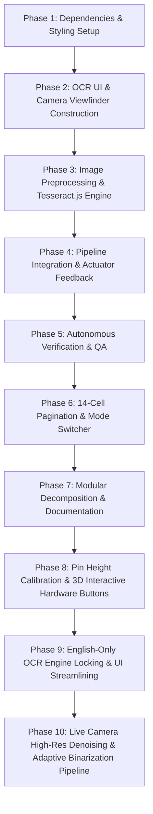

# BraillLens 3D - Task Graph & Implementation Plan
Version: 3.1.0 (Modular Codebase Standard)

---

## Plan Overview
This execution plan details the architecture and implementation of **BraillLens 3D & Optical OCR System**, including:
1. **Interactive 3D Simulation**: 14-cell / 84-pin tactile simulator with Three.js r128, X-Ray cutaway, exploded view, and 0W bistable latch mechanism.
2. **Omni-Channel OCR Ingestion**: Drag-and-drop file upload and live WebRTC camera capture with Canvas 2D preprocessing and Tesseract.js v5.
3. **14-Cell Tactical Pagination & Mode Switcher**: Single-language toggle (ENG/THAI), 14-cell chunking, and tactile Prev/Next navigation.
4. **Modular Architecture**: Clean separation into `index.html`, `css/styles.css`, `js/braille-engine.js`, `js/ocr-engine.js`, `js/three-scene.js`, `js/app.js`, and `README.md`.

---

## Execution Graph

---

## Detailed Task Breakdown

### Phase 1: Dependencies & Styling Setup
- [x] **Task 1.1: Integrate Tesseract.js v5 CDN into Document Header**
- [x] **Task 1.2: Add OCR UI Styles, Camera Viewfinder & Dark/Light Mode Tokens**

### Phase 2: OCR UI & Camera Viewfinder Construction
- [x] **Task 2.1: Construct OCR Ingestion Section in Control Panel**
- [x] **Task 2.2: Construct Live Camera Viewfinder Modal**
- [x] **Task 2.3: Construct OCR Progress HUD & Telemetry Status Bar**

### Phase 3: Image Preprocessing & Tesseract.js Engine
- [x] **Task 3.1: Implement Enhanced Canvas 2D Image Preprocessor**
- [x] **Task 3.2: Implement Tesseract.js Worker Engine (PSM 6 Mode)**
- [x] **Task 3.3: Implement Image File Upload & Drag-and-Drop Event Handlers**
- [x] **Task 3.4: Implement WebRTC Camera Controller & Snapshot Capture**

### Phase 4: Pipeline Integration & Actuator Feedback
- [x] **Task 4.1: Connect OCR Output to Braille Engine & 3D Hardware Simulation**
- [x] **Task 4.2: Add Tactical Feedback Signals & Telemetry Log**

### Phase 5: Autonomous Verification & QA
- [x] **Task 5.1: Create Autonomous Test Suite Script**
- [x] **Task 5.2: Validate HTML Syntax, CDN Links, and WebGL Context Stability**

### Phase 6: 14-Cell Tactical Pagination & Single-Language Mode Switcher
- [x] **Task 6.1: Implement 14-Cell Text Chunking & Pagination Navigation Engine**
- [x] **Task 6.2: Build Cyberpunk-Tactical Hardware Control Bar & Mode Switcher**

### Phase 7: Modular Decomposition & Documentation
- [x] **Task 7.1: Extract CSS Stylesheet into `css/styles.css`**
  - **File**: `file:///C:/Users/kt856/Downloads/Compressed/beaill/braillend/css/styles.css`
  - **Logic/Target**: Complete CSS styling with CSS variables, Dark/Light modes, OCR styles, and animations.
- [x] **Task 7.2: Split JavaScript into Dedicated Modules in `js/`**
  - **Files**:
    - `file:///C:/Users/kt856/Downloads/Compressed/beaill/braillend/js/braille-engine.js` (Dictionary, 14-cell chunking, pagination, language toggle)
    - `file:///C:/Users/kt856/Downloads/Compressed/beaill/braillend/js/ocr-engine.js` (Canvas preprocessor, Tesseract worker, WebRTC camera)
    - `file:///C:/Users/kt856/Downloads/Compressed/beaill/braillend/js/three-scene.js` (Three.js 3D viewport, 84-pin array, OLED canvas texture, mechanism modal)
    - `file:///C:/Users/kt856/Downloads/Compressed/beaill/braillend/js/app.js` (Subsystem bootstrap & DOM event dispatcher)
- [x] **Task 7.3: Create Main Entry File `index.html`**
  - **File**: `file:///C:/Users/kt856/Downloads/Compressed/beaill/braillend/index.html`
  - **Logic/Target**: Clean HTML linking to `css/styles.css` and loading modular scripts in sequential order.
- [x] **Task 7.4: Author Comprehensive Bilingual `README.md` User Manual**
  - **File**: `file:///C:/Users/kt856/Downloads/Compressed/beaill/braillend/README.md`
  - **Logic/Target**: Full Thai + English manual covering system overview, key features, step-by-step guides, and architecture.
- [x] **Task 7.5: Update Autonomous QA Test Suite for Modular Codebase**
  - **File**: `file:///C:/Users/kt856/Downloads/Compressed/beaill/braillend/tests/test_braille_ocr_pipeline.js`
  - **Logic/Target**: Verify `index.html`, `css/styles.css`, and all `js/*.js` modules with 100% pass rate.

### Phase 8: Pin Height Calibration & 3D Interactive Hardware Buttons
- [x] **Task 8.1: Pin Protrusion Scale Calibration (0.13 / 1.2mm Engineering Scale)**
  - **Files**: `file:///C:/Users/kt856/Downloads/Compressed/beaill/braillend/js/braille-engine.js`, `file:///C:/Users/kt856/Downloads/Compressed/beaill/braillend/js/three-scene.js`
  - **Logic/Target**: Calibrate 84-pin protrusion target height from 0.21 down to 0.13 (realistic 1.2mm scale without clipping) and sync Single-Pin Mechanism 3D modal.
- [x] **Task 8.2: 3D Hardware Button Meshes & High-Res Dynamic Canvas Textures**
  - **Files**: `file:///C:/Users/kt856/Downloads/Compressed/beaill/braillend/js/three-scene.js`
  - **Logic/Target**: Construct `btn3DPrev`, `btn3DNext`, `btn3DMode` with cyber accents, glowing borders, and realtime state sync.
- [x] **Task 8.3: Three.js Raycaster Mouse Interaction & Physical Press Effect**
  - **Files**: `file:///C:/Users/kt856/Downloads/Compressed/beaill/braillend/js/three-scene.js`
  - **Logic/Target**: Raycaster hover detection (`pointer` cursor + emissive highlight) and click actuation with physical depression spring animation calling `prevBraillePage()`, `nextBraillePage()`, and `toggleLanguageMode()`.
- [x] **Task 8.4: Autonomous QA Test Suite Expansion**
  - **Files**: `file:///C:/Users/kt856/Downloads/Compressed/beaill/braillend/tests/test_braille_ocr_pipeline.js`
  - **Logic/Target**: 27 unit and integration tests passing 100%.

### Phase 9: English-Only OCR Engine Locking & UI Streamlining
- [x] **Task 9.1: Lock Tesseract.js OCR Engine to English Only (`eng`)**
  - **Files**: `file:///C:/Users/kt856/Downloads/Compressed/beaill/braillend/js/ocr-engine.js`
  - **Logic/Target**: Hardcode OCR extraction engine language parameter to `'eng'` in `runOCRExtraction()` for 100% OCR stability and accuracy.
- [x] **Task 9.2: Set English Defaults across UI, Braille Engine, and Application Bootstrapper**
  - **Files**: `file:///C:/Users/kt856/Downloads/Compressed/beaill/braillend/index.html`, `file:///C:/Users/kt856/Downloads/Compressed/beaill/braillend/js/braille-engine.js`, `file:///C:/Users/kt856/Downloads/Compressed/beaill/braillend/js/app.js`, `file:///C:/Users/kt856/Downloads/Compressed/beaill/braillend/js/three-scene.js`
  - **Logic/Target**: Set `<option value="eng" selected>`, `currentLanguageMode = 'eng'`, English preset chips, placeholder, and initial `HELLO WORLD` display.
- [x] **Task 9.3: QA Test Suite Verification & Task Graph Synchronization**
  - **Files**: `file:///C:/Users/kt856/Downloads/Compressed/beaill/braillend/tests/test_braille_ocr_pipeline.js`, `file:///C:/Users/kt856/Downloads/Compressed/beaill/braillend/task-graph.md`
  - **Logic/Target**: 27 unit and integration tests passing 100%.

### Phase 10: Live Camera High-Res Denoising & Adaptive Binarization Pipeline
- [x] **Task 10.1: High-Res Native Video Capture (1080p Full HD)**
  - **Files**: `file:///C:/Users/kt856/Downloads/Compressed/beaill/braillend/js/ocr-engine.js`
  - **Logic/Target**: Configure WebRTC video stream constraints to ideal 1920x1080 and capture snapshot at full native resolution (`video.videoWidth` x `video.videoHeight`) on high-resolution canvas.
- [x] **Task 10.2: Camera Denoising Image Processing Pipeline**
  - **Files**: `file:///C:/Users/kt856/Downloads/Compressed/beaill/braillend/js/ocr-engine.js`
  - **Logic/Target**: Implement 4-step processing pipeline: (1) Standard Luminance Grayscale (BT.601: `0.299R + 0.587G + 0.114B`), (2) 3x3 Gaussian Denoise Filter (`[1,2,1; 2,4,2; 1,2,1]/16`) for sensor grain/noise removal, (3) 3x3 Sharpening Convolution & Min-Max Dynamic Contrast Stretching, (4) Bradley Adaptive Integral Local Binarization.
- [x] **Task 10.3: Crystal Clear Processed Denoised Dropzone Preview**
  - **Files**: `file:///C:/Users/kt856/Downloads/Compressed/beaill/braillend/js/ocr-engine.js`
  - **Logic/Target**: Render the processed, binarized, denoised image directly onto `#dropzonePreview` thumbnail card (`#previewThumbnail`) before/during OCR extraction.
- [x] **Task 10.4: Autonomous QA Test Suite Expansion & Validation**
  - **Files**: `file:///C:/Users/kt856/Downloads/Compressed/beaill/braillend/tests/test_braille_ocr_pipeline.js`, `file:///C:/Users/kt856/Downloads/Compressed/beaill/braillend/task-graph.md`
  - **Logic/Target**: 30 comprehensive unit & integration tests passing 100%.
